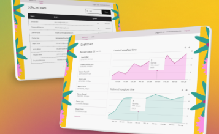

<h1 align="center">
  eDashboard
  <p align="center">
    
</p>
</h1>
<p align="center">
  <a href="#introduction">Introduction</a> •
  <a href="#features">Features</a> •
  <a href="#technologies">Technologies</a> •
  <a href="#getting-started">Getting Started</a> •
  <a href="#live-demo">Live Demo</a> •
  <a href="#screenshots">Screenshots</a> •
  <a href="#credits">Credits</a>
</p>

<br><br><br>
## Introduction

eDashboard is an advanced, functional dashboard built using React.js, TypeScript, Redux Toolkit (RTK), and Redux for efficient state management. It's designed to offer robust integration with modern technologies while providing an intuitive and user-friendly interface.
<br>
## Features

**· React Table:** Flexible data display and management.

**· Charts (Chart.js and Recharts):** Dynamic data visualization with responsive charts.

**· Redux State Management** Efficient and scalable state management with Redux and RTK.

**· Authentication:** Secure user authentication using RTK.
<br>
## Technologies

**·React.js**

**·TypeScript**

**·Redux Toolkit (RTK) and Redux**

**·React Router**

**·Sass**

**·Recharts**

**·Axios**

**·Formik**
<br>
## Getting Started

**1. Clone the Repository**

```bash
https://github.com/wawrzonnn/e-dashboard.git
```

**2. Install Dependencies**

```bash
npm install
```

**3. Run the Application**

```bash
npm run dev
```

The application will be running on **http://localhost:5173.**
<br>
## Live Demo

Experience eDashboard in action: [Live Demo Link](https://e-dashboard-psi.vercel.app/)
<br>
## Screenshots

#### ◇ Login

<p align="center">
  <a href="./docs/loginbig.png">
    
  </a>
</p>

#### ◇ Leads

<p align="center">
  <a href="./docs//leadsBig.png">
    
  </a>
</p>

#### ◇ Dashboard

<p align="center">
  <a href="./docs/dashboardBig.png">
    
  </a>
</p>
<br>
## Credits

Design provided by [Nerdbord.io](https://nerdbord.io).
